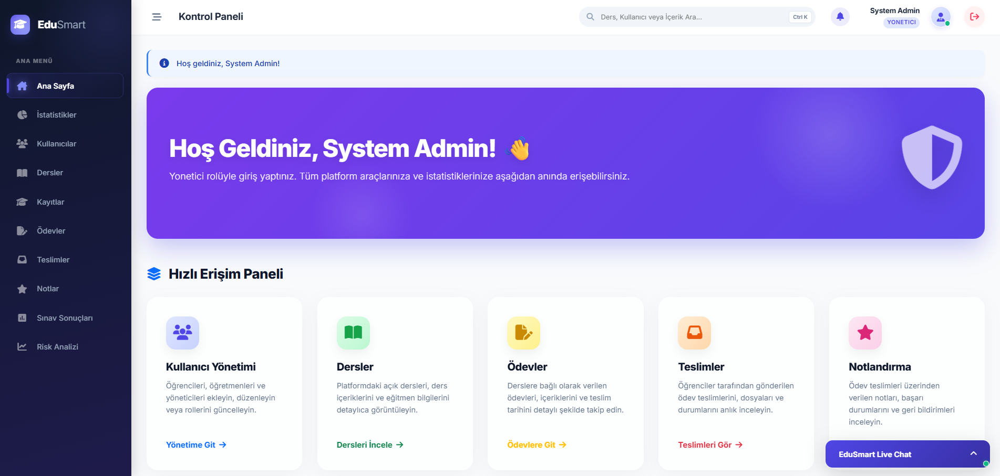
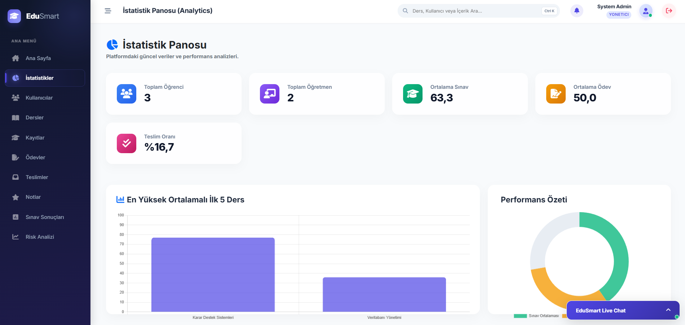
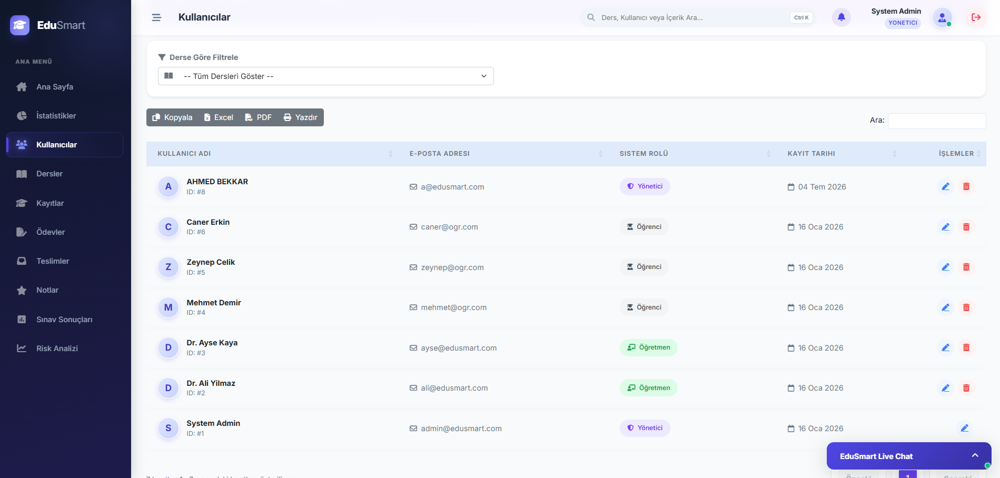
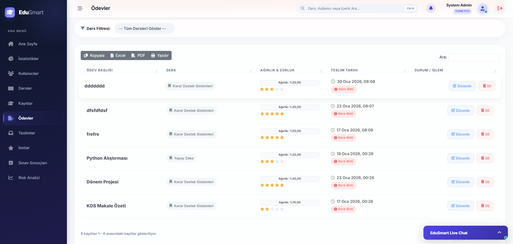
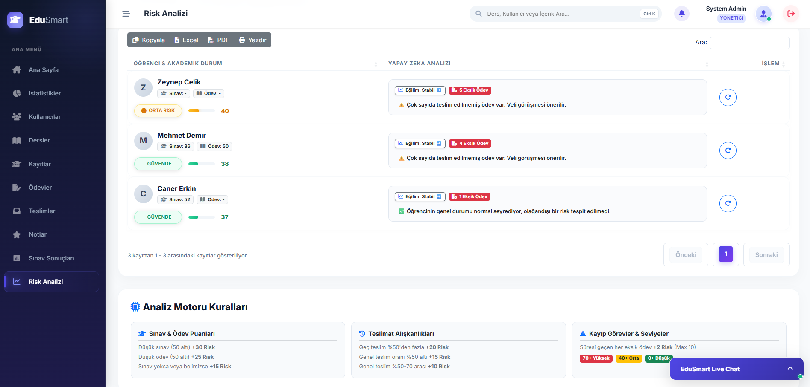
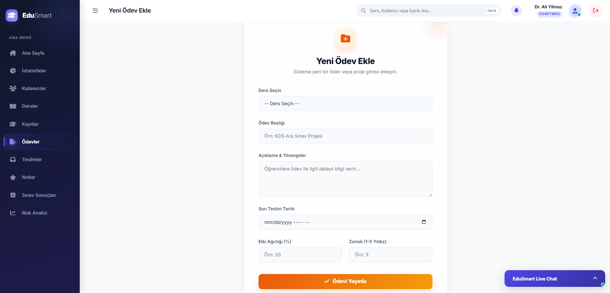
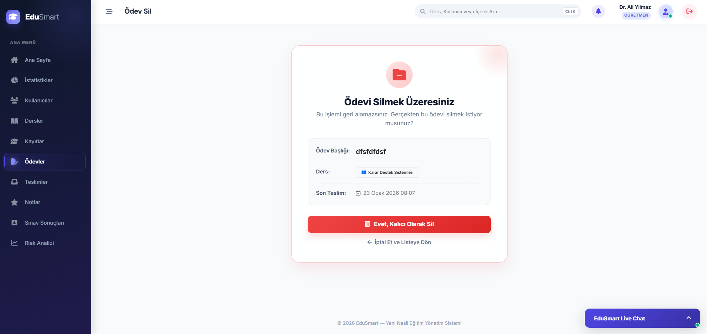
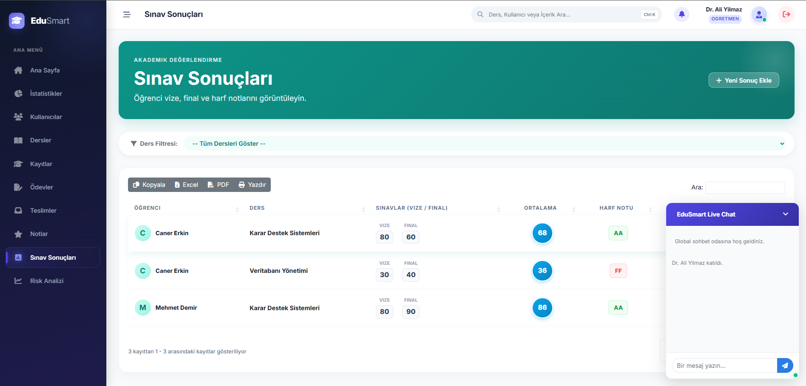
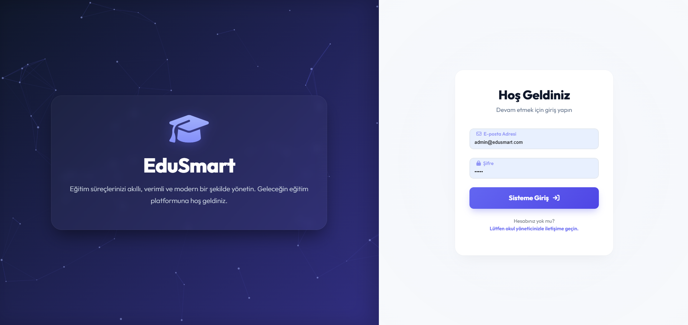

<div align="center">

# 🎓 EduSmart

**Next-Generation Learning Management & Educational Decision Support System (EDSS)**


EduSmart is a robust, highly interactive Learning Management System (LMS) designed to facilitate academic workflows, track student performance, and enable real-time communication. It moves beyond traditional course management by integrating algorithmic risk analysis and seamless real-time notifications to proactively identify at-risk students and streamline institutional operations.

</div>

---

## 📑 Table of Contents

- [Overview](#overview)
- [Tech Stack](#tech-stack)
- [Key Features & Smart Modules](#key-features--smart-modules)
- [Role and Access Matrix](#role-and-access-matrix)
- [Key Business Workflows (Scenarios)](#key-business-workflows-scenarios)
- [Installation and Setup](#installation-and-setup)
- [Screenshots](#screenshots)
- [Project Structure](#project-structure)

---

## 📖 Overview

EduSmart bridges the gap between administrators, educators, and students by providing a strictly isolated, role-based academic environment. The platform abandons legacy LMS interfaces in favor of a responsive, modern "Glassmorphism" UI. 

Its core value proposition lies in its function as an **Educational Decision Support System (EDSS)**. By replacing reactive grading with **proactive academic intervention** through the TOPSIS algorithm (a Multi-Criteria Decision Making approach), the system supports institutional administrators in making data-driven decisions regarding at-risk students. Additionally, it eliminates communication silos via a system-wide real-time live chat and asynchronous push notifications.

---

## 🛠️ Tech Stack

| Category | Technologies Used |
| :--- | :--- |
| **Backend** | ASP.NET MVC 5, C# (.NET Framework 4.8) |
| **Frontend** | HTML5, CSS3 (Glassmorphism), JavaScript (ES6+), Bootstrap 5 |
| **Database & ORM** | Microsoft SQL Server, Entity Framework 6 (Database-First) |
| **Libraries & APIs** | Microsoft SignalR, DataTables, jQuery, FontAwesome 6 |

---

## ✨ Key Features & Smart Modules

* **Educational Decision Support System (EDSS) via TOPSIS**
  * Acts as a powerful Decision Support System by implementing the *Technique for Order of Preference by Similarity to Ideal Solution* (TOPSIS).
  * A Multi-Criteria Decision Making (MCDM) mathematical model that evaluates student risk based on weighted criteria: GPA (50%), Attendance (30%), and Class Participation (20%).
  * **Decision Outcome:** Automatically ranks students, highlighting those in critical need of academic intervention, empowering administrators to make fast, accurate support decisions.
* **Real-Time Communication (SignalR)**
  * A global, persistent live chat widget accessible across all authenticated sessions.
  * Features real-time broadcasting, role-based identification badges, auto-scrolling, and audio cues.
* **Smart Push Notifications**
  * Hybrid architecture utilizing a lightweight JSON persistence layer (`notifications.json`) to prevent database I/O bottlenecks.
  * Instantly pushes role-based alerts (e.g., assignment creations, submissions, and grading updates) directly to targeted browsers via SignalR.
* **Client-Side Data Processing**
  * Transforms standard tables into highly interactive data grids using **DataTables**.
  * Supports instantaneous DOM filtering, pagination, and multi-format data export (PDF, Excel, Print).
* **Global Search & Modern UI/UX**
  * Features a system-wide search mechanism (accessible via `Ctrl+K`) that performs zero-latency DOM filtering on tables and cards without server roundtrips.
  * The interface is built on a responsive "Glassmorphism" design system, utilizing translucent backgrounds and smooth micro-interactions to reduce cognitive load.
* **Advanced Security Measures**
  * **Password Cryptography:** Implements PBKDF2 (HMACSHA256) with unique cryptographic salts for robust password hashing (`PasswordService`).
  * **CSRF Protection:** Strict enforcement of Anti-Forgery Tokens (`[ValidateAntiForgeryToken]`) across all POST endpoints.

---

## 🔐 Role and Access Matrix

The system enforces strict RBAC (Role-Based Access Control) using intercepting base controllers.

| Feature / Capability | Admin (Yönetici) | Teacher (Öğretmen) | Student (Öğrenci) |
| :--- | :---: | :---: | :---: |
| **System-Wide Analytics & TOPSIS** | ✅ | — | — |
| **Manage Users & Enrollments** | ✅ | — | — |
| **Create & Manage Course Assignments**| ✅ | ✅ | — |
| **Grade Student Submissions** | ✅ | ✅ | — |
| **Submit Files to Assignments** | — | — | ✅ |
| **View Personal Grades & Results** | ✅ | ✅ | ✅ |
| **Global Live Chat & Notifications** | ✅ | ✅ | ✅ |

---

## 🔄 Key Business Workflows (Scenarios)

To fully understand how EduSmart integrates its modules, here are the primary system scenarios:

1. **The Academic Assignment Lifecycle**
   * **Creation:** A Teacher creates an assignment. The system's hybrid notification engine triggers, sending a real-time SignalR push notification to all Students enrolled in that specific course.
   * **Submission:** A Student uploads their homework (with strict file extension validation). The system logs the timestamp and fires an instant notification back to the Teacher.
   * **Grading & Feedback:** The Teacher grades the submission. The database updates, and the Student receives a personalized, real-time alert with their final score.
2. **Decision Support Workflow (Risk Analysis)**
   * **Data Aggregation:** The system continuously monitors Student GPA, Attendance, and Participation metrics.
   * **Algorithmic Processing:** The Admin navigates to the Risk Analysis Dashboard. The `TopsisPriorityService` processes the matrices in real-time.
   * **Decision Empowerment:** The Admin is presented with prioritized data cards, pinpointing exactly which students require immediate counseling, effectively transforming raw data into actionable decisions.
3. **Real-Time Communication Flow**
   * Upon login, users are seamlessly connected to the `ChatHub`. Messages broadcast instantly to all connected clients, rendering role-specific badges (e.g., "Admin", "Teacher") and playing subtle audio cues to maintain high engagement.

---

## 🚀 Installation and Setup

### Prerequisites
* Microsoft Visual Studio 2022 (with ASP.NET workload)
* .NET Framework 4.8 Developer Pack
* Microsoft SQL Server (LocalDB or Express Edition)

### Step 1: Clone the Repository
Open your terminal and clone the repository:
```bash
git clone https://github.com/your-username/EduSmart.git
cd EduSmart
```

### Step 2: Restore the Database
EduSmart utilizes Entity Framework 6 with a **Database-First** architecture. You cannot use Code-First migrations (e.g., `Update-Database`) to build the database.

1. Open SQL Server Management Studio (SSMS).
2. Create a new, empty database named `EduSmart_DB`.
3. Locate the SQL script provided in this repository at `EduSmart/Database/EduSmart_DB.sql`.
4. Execute the script against your newly created `EduSmart_DB` to generate the required tables, relationships, and default seed data.

### Step 3: Configure `Web.config`
Navigate to the root of the web project and open `Web.config`. Update the `<connectionStrings>` block to point to your local SQL Server instance:
```xml
<connectionStrings>
  <add name="EduSmart_DBEntities" 
       connectionString="metadata=res://*/Models.Model1.csdl|res://*/Models.Model1.ssdl|res://*/Models.Model1.msl;provider=System.Data.SqlClient;provider connection string=&quot;data source=YOUR_SERVER_NAME;initial catalog=EduSmart_DB;integrated security=True;MultipleActiveResultSets=True;App=EntityFramework&quot;" 
       providerName="System.Data.EntityClient" />
</connectionStrings>
```

### Step 4: Build and Run
1. Open `EduSmart.sln` in Visual Studio.
2. Right-click the Solution and select **Restore NuGet Packages**.
3. Set the web project as the **Startup Project**.
4. Press `F5` to build and launch the application via IIS Express.

### Default Test Credentials
| Role | Username | Password |
| :--- | :--- | :--- |
| **Admin** | `admin` | `admin123` |
| **Teacher** | `teacher1` | `password` |
| **Student** | `student1` | `password` |

*(Note: Passwords in the database are hashed using PBKDF2)*

---

## 📸 Screenshots

| Admin Dashboard | Analytics Dashboard | Users Management |
| :---: | :---: | :---: |
|  |  |  |

| Assignments | Risk Analysis | Add Assignment |
| :---: | :---: | :---: |
|  |  |  |

| Delete Modal | Exam Results & Chat | Login Page |
| :---: | :---: | :---: |
|  |  |  |
---

## 📁 Project Structure

```text
EduSmart/
├── Database/
│   └── EduSmart_DB.sql             # Full database schema and seed data
├── App_Data/
│   └── notifications.json          # Lightweight NoSQL notification storage
├── App_Start/
│   └── RouteConfig.cs              # Application routing definitions
├── Controllers/
│   ├── BaseController.cs           # Middleware for RBAC and Auth checks
│   ├── RiskAnaliziController.cs    # TOPSIS algorithm endpoints
│   ├── OdevlerController.cs        # Assignment management
│   └── ...                         
├── Hubs/
│   └── ChatHub.cs                  # SignalR server for chat & notifications
├── Models/
│   ├── Model1.edmx                 # Entity Framework DB Schema
│   └── Notification.cs             # Ephemeral notification data model
├── Services/
│   ├── NotificationService.cs      # Core logic for JSON read/writes
│   ├── PasswordService.cs          # PBKDF2 cryptographic hashing
│   └── TopsisPriorityService.cs    # MCDM mathematical calculations
├── Views/
│   ├── Shared/
│   │   └── _Layout.cshtml          # Master UI, Glassmorphism, SignalR clients
│   └── ...
├── Web.config                      # Connection strings and application settings
└── EduSmart.sln                    # Visual Studio Solution File
```

---

## 🤝 Contributing

Contributions, issues, and feature requests are welcome! 
If you'd like to contribute, please fork the repository and make changes as you'd like. Pull requests are warmly welcome.

1. Fork the Project
2. Create your Feature Branch (`git checkout -b feature/AmazingFeature`)
3. Commit your Changes (`git commit -m 'Add some AmazingFeature'`)
4. Push to the Branch (`git push origin feature/AmazingFeature`)
5. Open a Pull Request

---

## 📄 License

Distributed under the MIT License. See `LICENSE` for more information.

---

## 📬 Contact

**Ahmad** - [GitHub Profile](https://github.com/your-username) - your.email@example.com

Project Link: [https://github.com/your-username/EduSmart](https://github.com/your-username/EduSmart)

